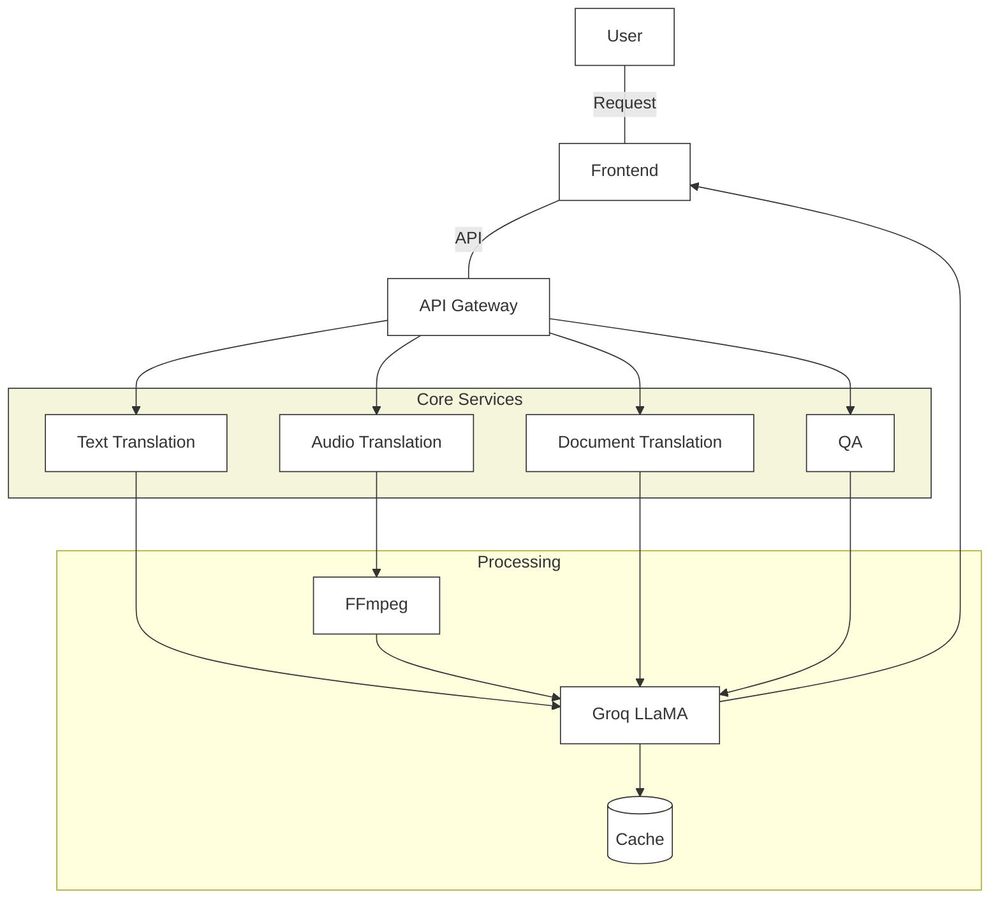

```mermaid
graph TB
    %% Main Flow
    Client[User] ---|Request| Frontend[Frontend]
    Frontend ---|API| Gateway[API Gateway]

    %% Services Layer
    subgraph Services[Core Services]
        direction TB
        Text[Text Translation]
        Audio[Audio Translation]
        Doc[Document Translation]
        QA[QA]
    end

    %% Backend Layer
    subgraph Backend[Processing]
        direction TB
        LLM[Groq LLaMA ]
        Process[FFmpeg]
        DB[(Cache)]
    end

    %% Clean Connections
    Gateway --> Text
    Gateway --> Audio
    Gateway --> Doc
    Gateway --> QA

    Text --> LLM
    Audio --> Process
    Process --> LLM
    Doc --> LLM
    QA --> LLM

    LLM --> DB
    LLM --> Frontend

    classDef default fill:#ffffff,stroke:#333;
    classDef services fill:#f5f5dc,stroke:#333;
    class Services services;
```