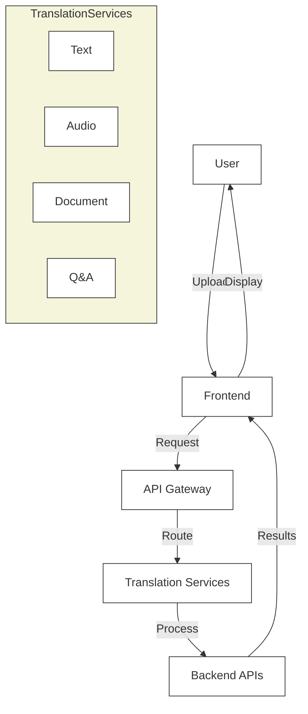

```mermaid
graph TD
  %% Level 0
  A[User] -->|Upload| B[Frontend]
  
  %% Level 1
  B -->|Request| C[API Gateway]
  
  %% Level 2
  C -->|Route| D[Translation Services]
  
  %% Level 3
  D -->|Process| E[Backend APIs]
  
  %% Return flow
  E -->|Results| B
  B -->|Display| A
  
  subgraph TranslationServices
    F[Text]
    G[Audio]
    H[Document]
    I[Q&A]
  end
  
  classDef default fill:#ffffff,stroke:#333;
  classDef services fill:#f5f5dc,stroke:#333;
  class TranslationServices services;
```